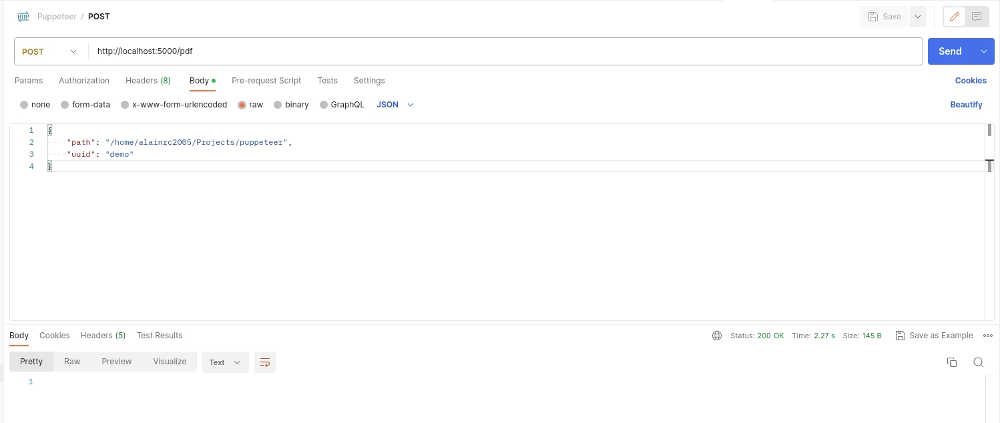

# Puppeteer PDF Generator
Proyecto demostrativo de como convertir HTML hacia PDF cumpliendo con todo el estándar HTML, CSS y JavaScript actual

## Herramientas utilizadas
````json
"dependencies": {
    "colors": "^1.4.0",
    "dotenv": "^16.3.1",
    "express": "^4.18.2",
    "http": "^0.0.1-security",
    "puppeteer": "^21.3.6"
  }
````

## Posibles variables de entorno en un .env
| Variable | Descripción |
|-----------------|:-----------------------------------------:|
|SOCKET_PORT=5000 |  # Puerto sobre el que responderá la app  |
|VERBOSE=yes | # A futuro para posibles mensajes modo debug|  

## Modo de uso
Sencillamente realizando una petición POST/pdf con parámetros de entrada


## Parámetros de entrada de la petición POST/pdf
````json
{
    "path": "ruta_donde_se_encuentra_archivo_html_sin_slash",
    "uuid": "nombre_archivo_html_sin_extensión"
}
````

## Salida
La petición POST/pdf genera en <strong>path</strong> el archivo [uuid].pdf, donde uuid es el nombre de entrada.
## Licencia
Siéntanse libre de utilizar este código como lo deseen. Gracias.
Alain Ramírez Cabrejas (alainrc2005@gmail.com)
